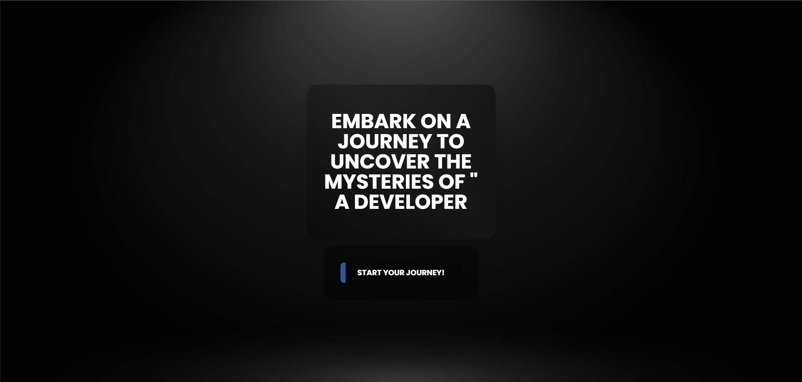
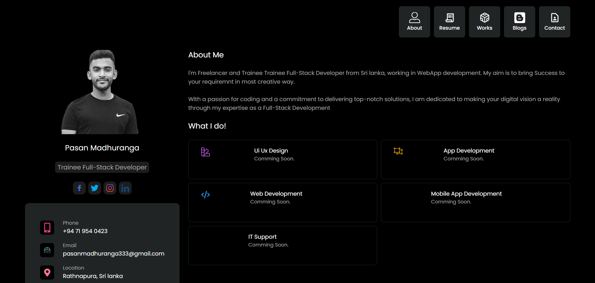
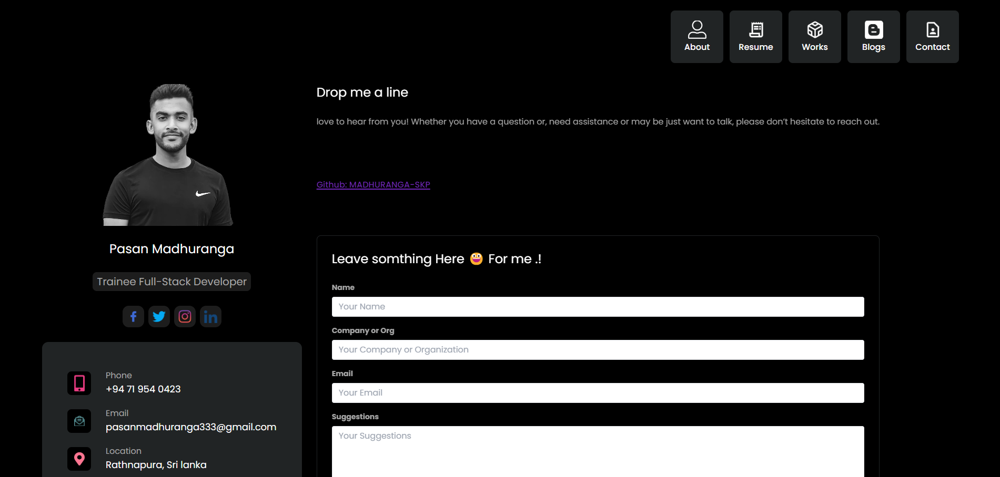

# Portfolio Sample Website

Welcome to my portfolio website! This website version 0.1 of my Per-portfolio to showcases my projects, and skills, and provides information about me.

## Technologies Used

- **React:** A JavaScript library for building user interfaces.
- **Gatsby:** A React-based static site generator.
- **Tailwind CSS:** A utility-first CSS framework.
- **Firebase:** A platform developed by Google for creating mobile and web applications.

## Features

- not responsive yet
- Realtime updates powered by Firebase Realtime Database.
- Fast page loads with Gatsby's static site generation.

## Live Demo

Check out the live demo: https://per-portfolio-6014c.firebaseapp.com/

## welcome page

## About page

## Contact page

   
